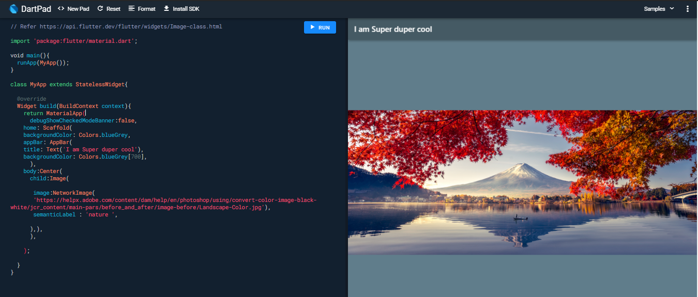
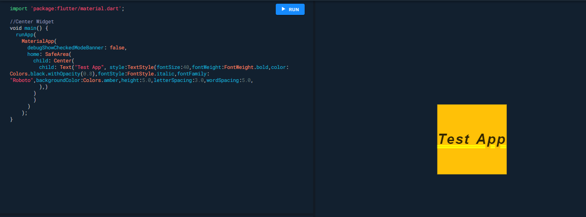
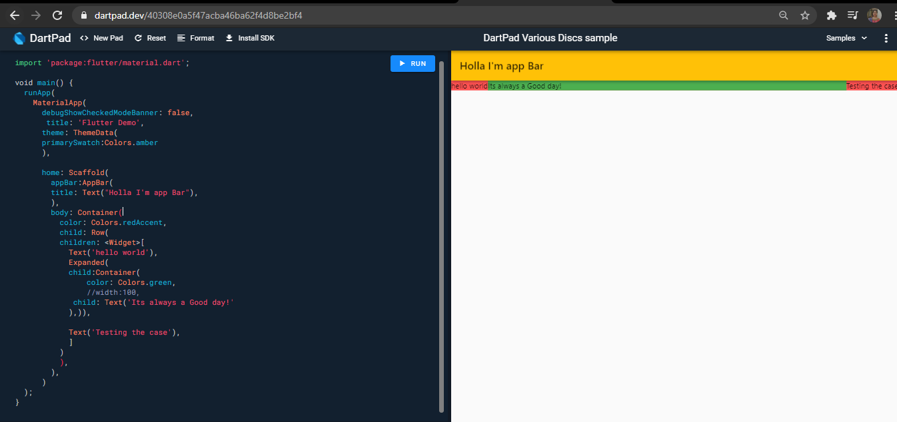
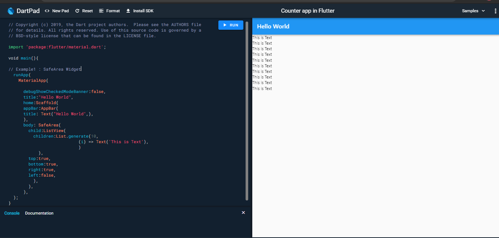
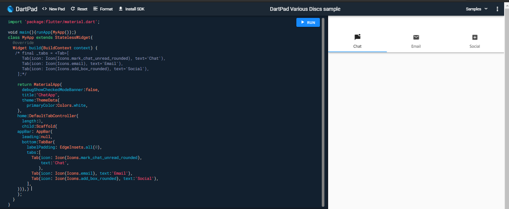
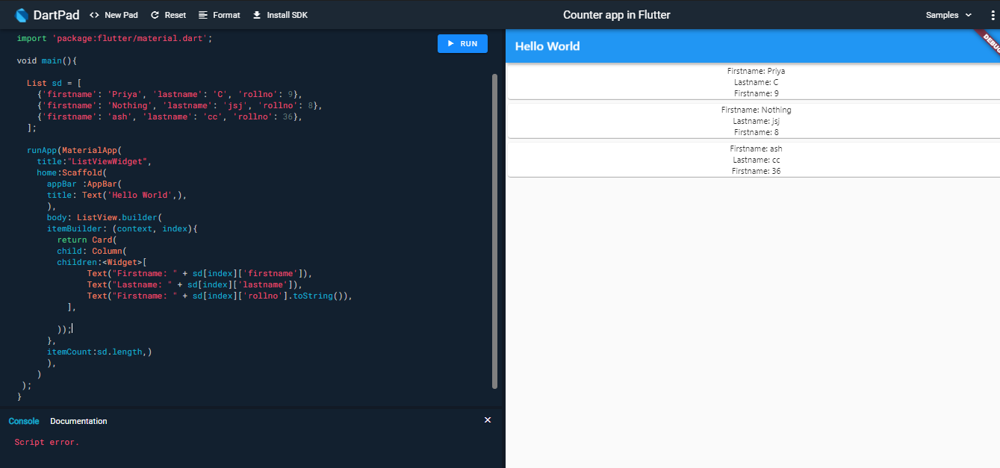
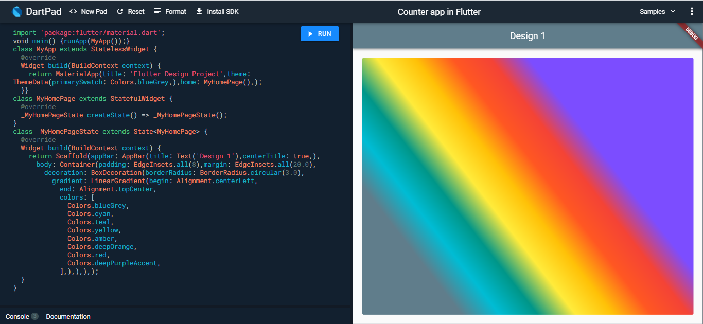

# Dart and Flutter Learnings

For DartBasics refer to [dartbasics.md file](dartbasics.md)

- [Image Class Widget](https://api.flutter.dev/flutter/widgets/Image-class.html)
- [Container Class Widget](https://api.flutter.dev/flutter/widgets/Container-class.html)
- [Icons Class Widget](https://api.flutter.dev/flutter/material/Icons-class.html)
- [Icon Class Widget](https://api.flutter.dev/flutter/widgets/Icon-class.html)
- [AssetImage Class Widget](https://api.flutter.dev/flutter/painting/AssetImage-class.html)

### To create [App icons](https://appicon.co/)

### Screenshot of the learnings

### Image Class Widget

### Center Widget

### Expanded Widget

### SafeArea Widget

### TabBar Widget

### Array of object

### List View Builder

### Linear Gradient

